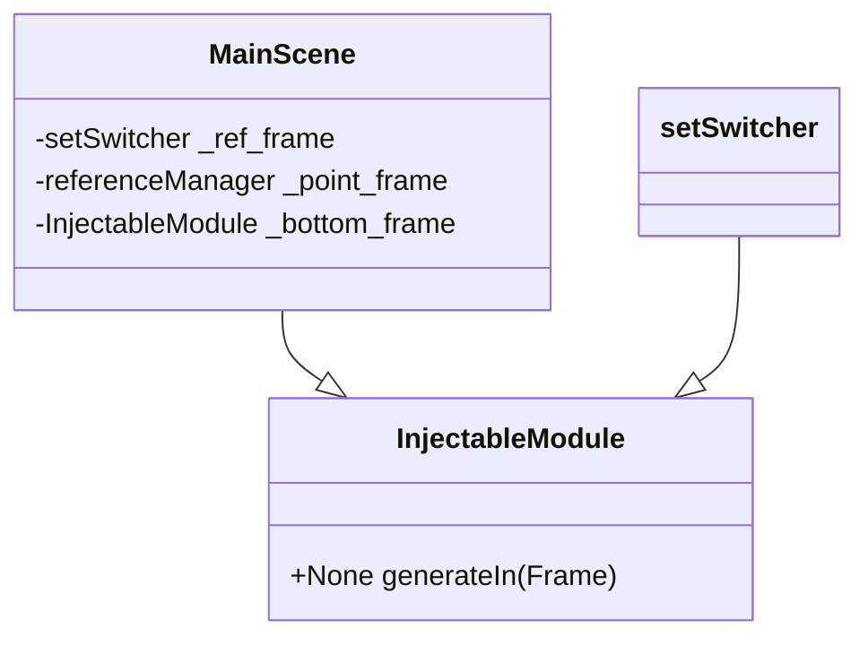

# Solis-Remote

## Class diagram

```mermaid
classDiagram
    class InjectableModule
    InjectableModule: +None generateIn(Frame)
    class MainScene{
        -setSwitcher _ref_frame
        -referenceManager _point_frame
        -InjectableModule _bottom_frame
    }
    MainScene--|>InjectableModule
    class setSwitcher{

    }
    setSwitcher--|>InjectableModule

```